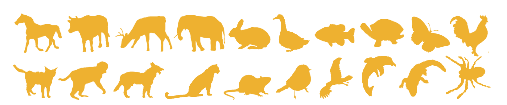

# Animal-Dataset
Dataset for X. Bai, W. Liu, and Z. Tu. Integrating contour and skeleton for shape classification. In ICCV Workshops, 2009.

**Link:** https://www.vlrlab.net/admin/uploads/avatars/Integrating_Contour_and_Skeleton_for_Shape_Classification.pdf

**Download from:** https://sites.google.com/site/xiangbai/animaldataset

## Examples:

